# Rapport intermédiaire Saé 2.03
 Ce rapport consiste à décrire chaques étapes nécéssaires pour créer une première machine virtuelle équipé de debian 11,puis une deuxième de manière automatique et comment instaler et configurer les packages git et gitea.
 
## Sommaire 
 
1. [Creation d'une machine virtuelle](#Creation-d'-une-machine-virtuelle)
2. [Installation Debian  par pré-configuration](#Installation-Debian-par-pré-configuration)
3. [Gitea](#gitea)


# Creation d'une machine virtuelle

## Prérequis de la machine : 

    • VirtualBox installé 
    
    • 4 Go de RAM minimum

    • 20 Go d’espace disque ou plus
    
    • VirtualBox installé avec son «extension pack» (VBoxGuestAddition.iso) sur la machine hôte.

    
    ___

## Caractéristiques de la machine virtuelle :
    + Nom de la machine  : sae203
    + Dossier de la machine : /usr/local/virtual_machine/infoetu/arthur.delobel.etu
    + Type : Linux
    + Version : Debian ou Debian 11 en 64-bit
    + Mémoire vive (RAM) : 2048 Mo pour être à l’aise à l’usage.
    + Disque dur : 20 Go entier (une seule partition)


# 1.1 Creation de la machine virtuelle{#Création_VM}

>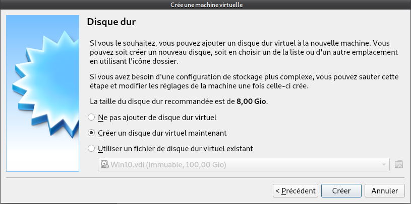{#a1}
>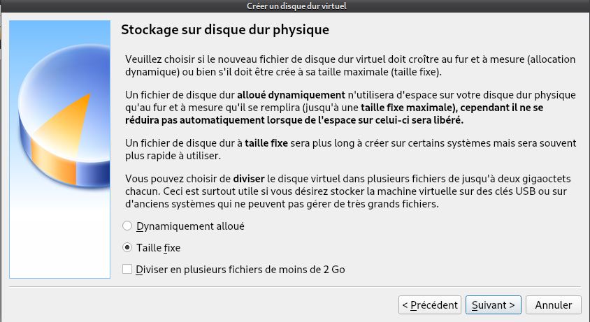{#a2}
>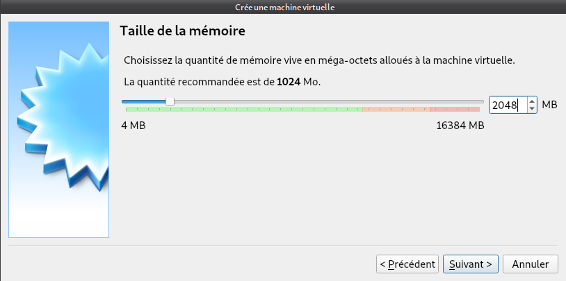{#a3}
>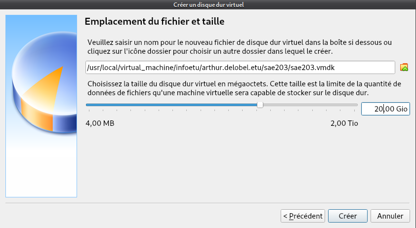{#a4}
>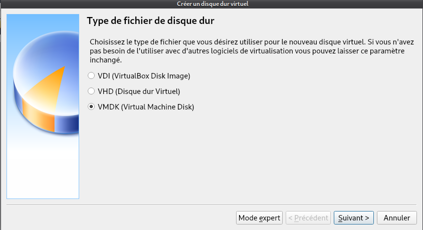{#a5}

### - Que signifie “64-bit” dans “Debian 64-bit” ?

    Un processeur 64 bits est un microprocesseur dans laquelle la taille d'un mot 
    machine est de 64 bits ; une condition indispensable pour les applications fortement consommatrices de données et de mémoire d'où la mémoire vive (RAM) de 
    2048 Mo et 20go de disque dur afin de supporter l’OS Debian 11.

    https://www.lemagit.fr/definition/64-bits#:~:text=Un%20processeur%2064%20bits%20est,et%20les%20serveurs%20hautes
    %20performances)


### - Quelle est la configuration réseau utilisée par défaut ?

    Dynamic Host Configuration Protocol est un protocole réseau dont le rôle est d’assurer la configuration automatique des paramètres IP d’une station ou d'une machine.
    Il est à l'origine, par exemple, du choix d'adresse IP et du masque d'un sous-réseau.


### - Quel est le nom du fichier XML contenant la configuration de votre machine et Sauriez-vous modifier directement ce fichier pour mettre 2 processeurs à votre machine ?

    Le fichier Xml qui contient tout la configuration XMl de notre machine s’appelle 
    sae203.vbox et donc pour mettre 2 processeur a la machine virtuel il suffit de mettre “<count=2>” 


## Installation de l'OS
Caractéristiques à considérer :

• Nom de la machine  : serveur

• Domaine : Laisser vide

• Pays/langue : France

• Miroir : http://debian.polytech-lille.fr

• Proxy si nécessaire : http://cache.univ-lille.fr:3128

• Compte administrateur : root / root

• Un Compte utilisateur : User / user / user

• Partition : 1 seule partition recouvrant le disque entier

• Sélection des logiciels de démarrage (Paquetages logiciels à préinstaller pour se simplifier la vie par la suite) :
    a. environnement de bureau Debian
    b. … MATE (penser à décocher Gnome)
    c. serveur web
    d. serveur ssh
    e. utilitaire usuels du système


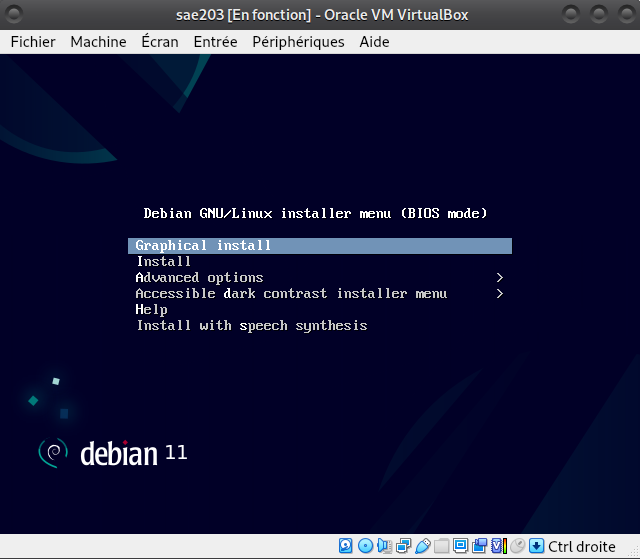

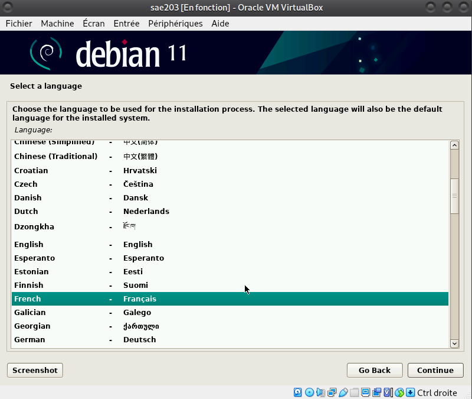
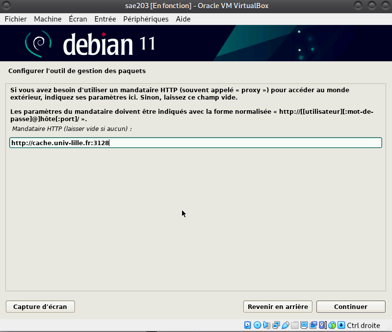
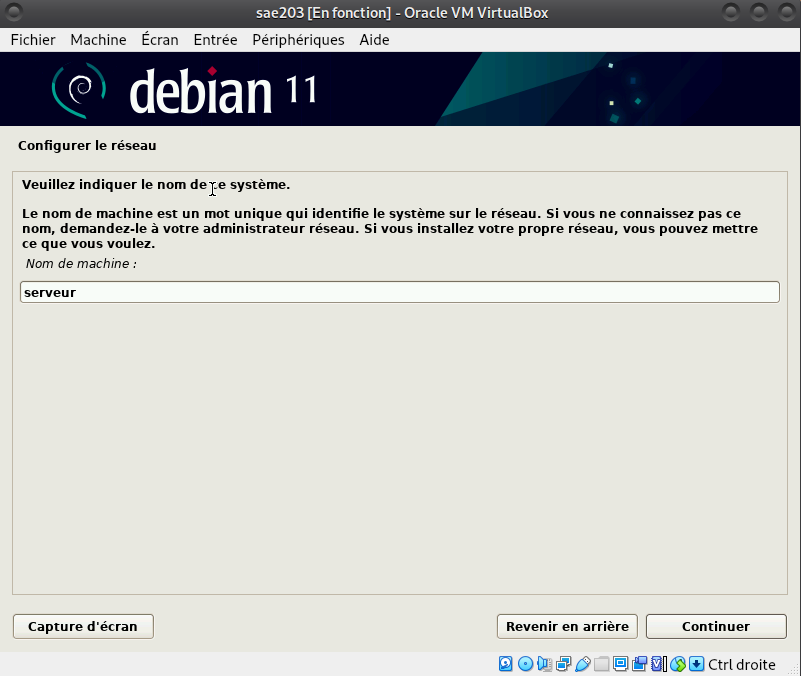
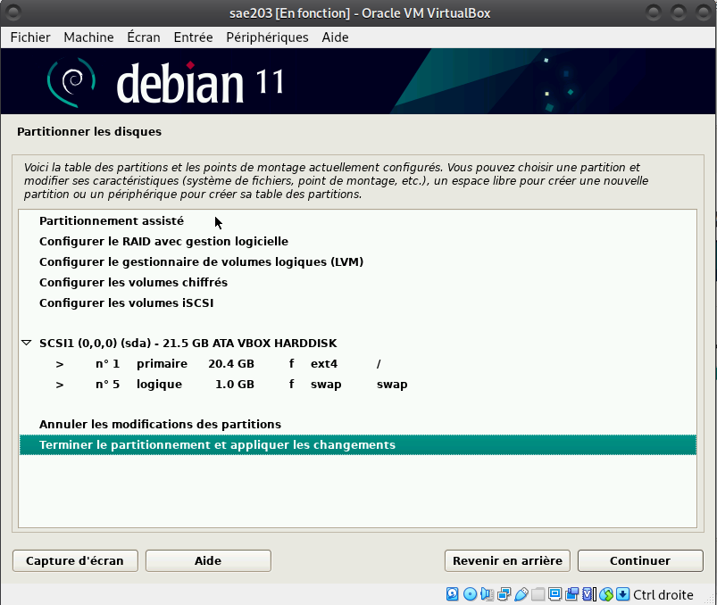
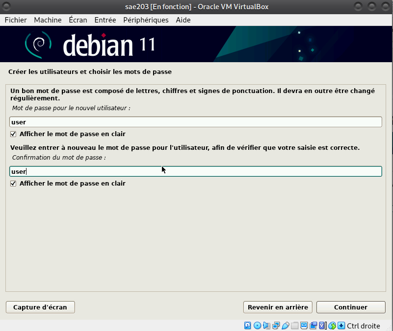
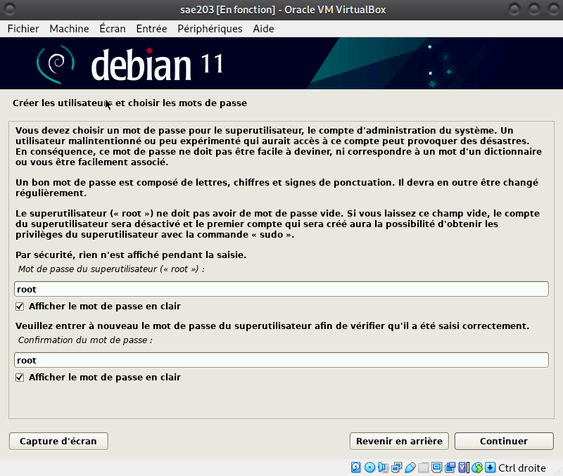
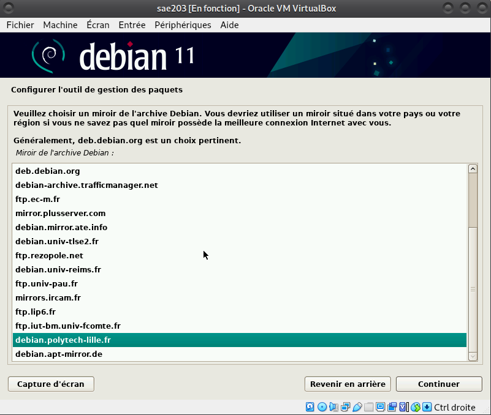
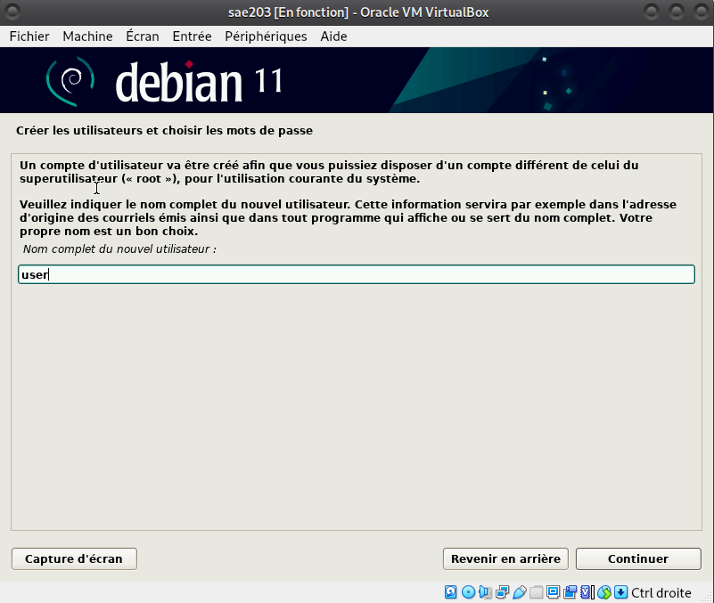
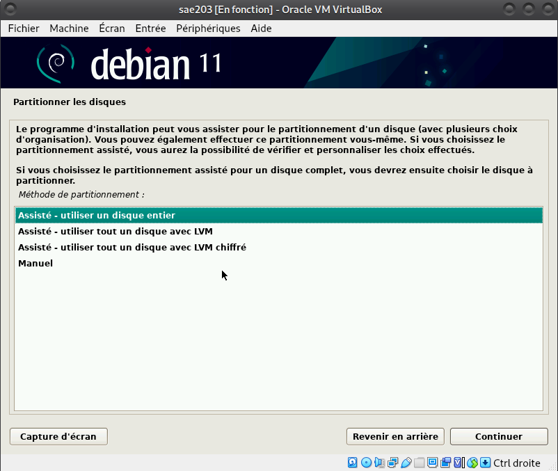
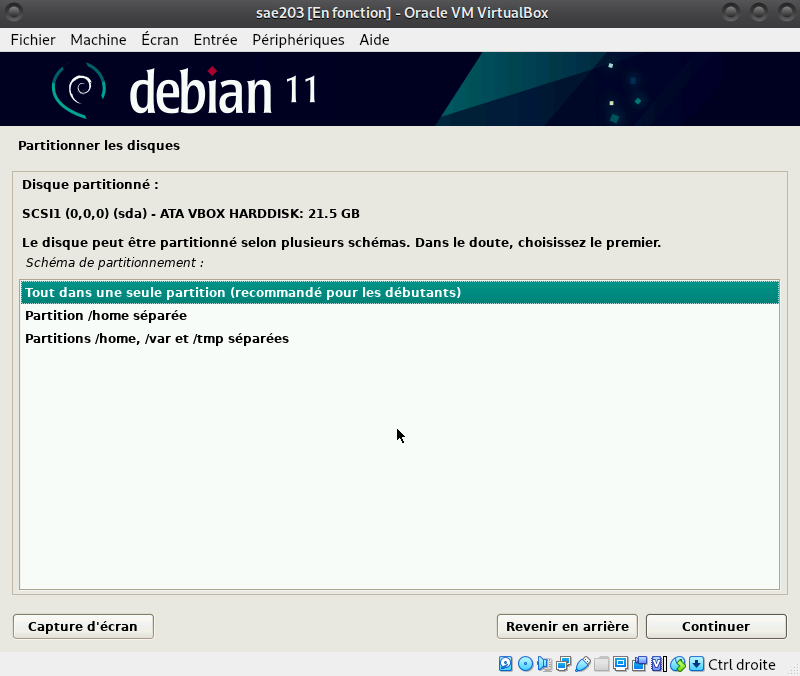
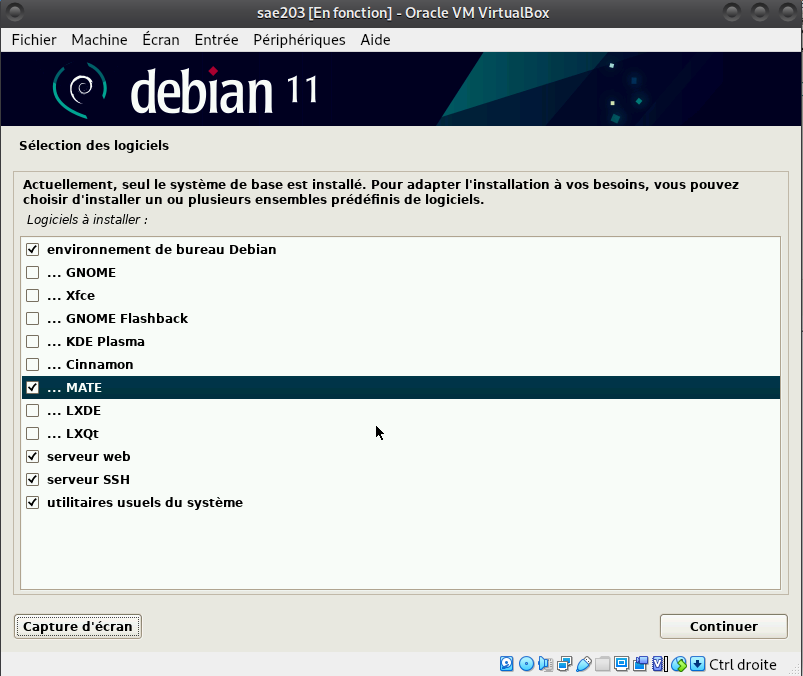


### Qu'est-ce qu'un fichier iso bootable ?

On dit d'un disque qu'il est « bootable » lorsqu'il contient les composants logiciels nécessaires pour être démarré directement au chargement de l'ordinateur,
avant le chargement du système d'exploitation installé sur la machine.

https://www.futura-sciences.com/tech/definitions/informatique-bootable-18095/#:~:text=On%20dit%20d'un%20disque,exploita
tion%20install%C3%A9%20sur%20la%20machine.


### Qu'est-ce que MATE ? GNOME ?

MATE (prononcer maté à l'espagnole) est un environnement de bureau libre utilisant (dans un premier temps) la boîte à outils GTK+ 3. x et destiné aux systèmes d'exploitation apparentés à UNIX.


### Qu'est-ce qu'un serveur web ?

Un serveur web est un ordinateur qui stocke les fichiers qui composent un site web (par exemple les documents HTML, les images, les feuilles de style CSS,
les fichiers JavaScript) et qui les envoie à l'appareil de l'utilisateur qui visite le site.

https://developer.mozilla.org/fr/docs/Learn/Common_questions/Web_mechanics/What_is_a_web_server


### Qu’est-ce qu’un serveur ssh ?

SSH, ou Secure Socket Shell, est un protocole réseau qui permet aux administrateurs d'accéder à distance à un ordinateur, en toute sécurité.
SSH désigne également l'ensemble des utilitaires qui mettent en œuvre le protocole.

http://web.mit.edu/rhel-doc/4/RH-DOCS/rhel-rg-fr-4/ch-ssh.html#:~:text=SSH%E2%84%A2%20(ou%20Secure%20SHell,des%20sy
st%C3%A8mes%20h%C3%B4te%20de%20serveurs.


### Qu’est-ce qu’un serveur mandataire ?

Dispositif informatique associé à un serveur et réalisant, pour des applications autorisées, des fonctions de médiation,
telles que le stockage des documents les plus fréquemment demandés ou l'établissement de passerelles.

https://www.techno-science.net/definition/3812.html


# 1.2 Installation de debian sur la machine virtuelle (1.2){#Installation_debian11}


## Accès sudo pour user

• Se connecter en tant que root (identifiant : root, mot de passe : root)

• Activer le Soft Keyboard (Barre du haut de la machine virtuelle -> Entrée -> Clavier -> Soft Keyboard)

• Presser Ctrl + Alt + T pour ouvrir le terminal

• Entrer "sudo addgroup user sudo"

• Se déconnecter puis se connecter en tant que user


### Comment peux-ton savoir à quels groupes appartient l’utilisateur user ?

Pour savoir quel utilisateur appartient à quel groupe, il faut regarder dans le fichier /etc/group.


## Installation des suppléments invités

• Insérer le cd des suppléments (Barre du haut de la machine virtuelle -> Périphériques -> insérer l'image CD des Additions invité...)

• Entrer dans le terminal "sudo mount /dev/cdrom /mnt" pour monter le CD

• Entrer dans le terminal "sudo /mnt/VBoxLinuxAdditions.run" pour installer les suppléments

• Redémarrer la machine virtuelle puis se connecter avec le compte user


>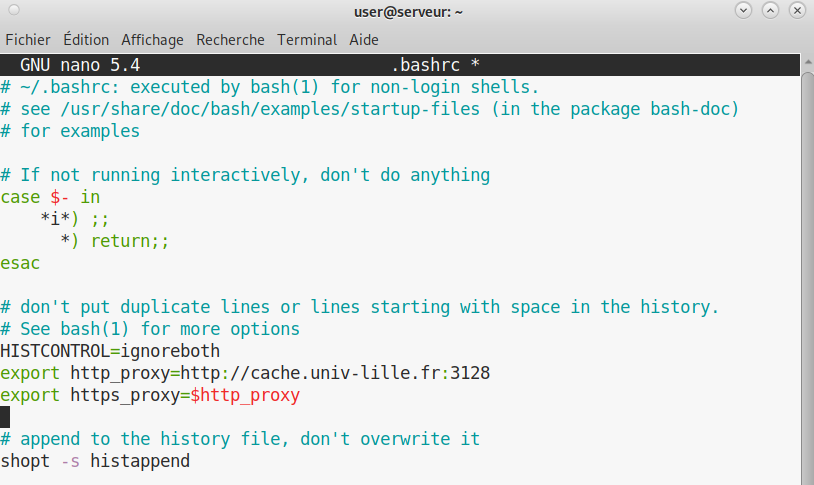
>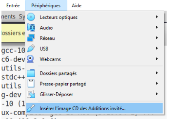
>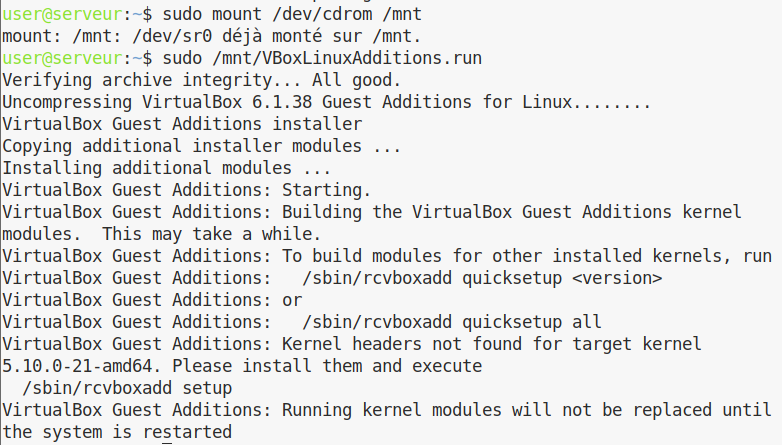
>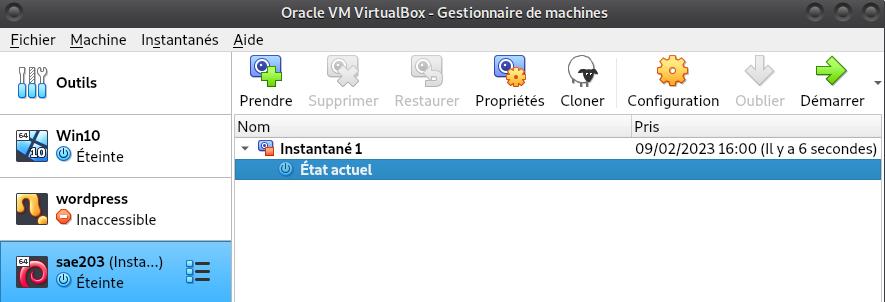
>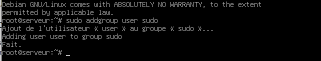
>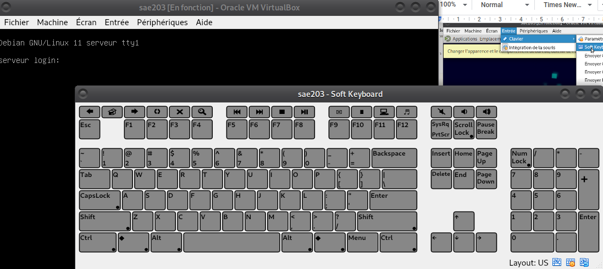


### Quel est la version du noyau Linux utilisé par votre VM ?

La version du noyau linux est 5.10.0-21-amd64


### À quoi servent les suppléments invités ?

• Intégration du pointeur de la souris : permet d'utiliser le même pointeur de souris sur l'hôte et l'invité. En l'activant, vous n'aurez plus qu'un seul pointeur de souris. Il ne sera plus nécessaire d'appuyer sur la touche Hôte pour libérer la souris du système d'exploitation invité.

• Intégration transparente des fenêtres : les fenêtres qui sont affichées sur la machine virtuelle peuvent être mappées sur la machine hôte, comme si l’application sur l’invité était réellement en cours d’exécution sur l’hôte.

• Synchronisation de l’heure entre l’hôte et l’invité.

• Presse-papiers partagé : le presse-papiers du système d’exploitation invité peut être partagé avec le système d’exploitation hôte et inversement.

• Connexions automatisées.

https://lecrabeinfo.net/virtualbox-installer-les-additions-invite-guest-additions.html#:~:text=Les%20additions%20invit%C3%A9%20(guest%20additio
ns,h%C3%B4te%20et%20la%20machine%20invit%C3%A9.


### À quoi sert la commande mount ?

La commande mount permet de demander au système d'exploitation de rendre un système de fichiers accessible, à un emplacement spécifié (le point de montage).


## Précision sur le Proxy

• Pour configurer le proxy sur celui de l'IUT, trouver et ouvrir le fichier "./bashrc", entrer "export http_proxy=http://cache.univ-lille.fr:3128" dans un premier temps,
  puis entrer "export https_proxy=$http_proxy" dans une seconde ligne.


# Installation Debian  par pré-configuration

#### pré-configuration

Récupérer l’archive autoinstall.zip sur Moodle et décompresser-là dans le répertoire de votre
machine virtuelle.
• Remplacer la chaîne @@UUID@@ par un identifiant unique universel. Le plus simple est d’exécuter la commande ci-dessous en étant placé dans le même répertoire que votre fichier S203-Debian11.viso. 
```bash
  sed -i -E "s/(--iprt-iso-maker-file-marker-bourne-sh).*$/\1=$(cat/proc/sys/kernel
  /random/uuid)/" S203-Debian11.viso
  ```
• Insérer le fichier S203_Debian11.viso dans le lecteur optique (cd/dvd) de votre machine virtuelle ;
• Démarrer la machine virtuelle et laissez l’installation se dérouler jusqu’au reboot.

1. Rajout de sudo à l'utilisateur standard : 
  - d-i passwd/user-default-groups string audio cdrom video sudo
2. Installation de l'envirronnement MATE :
  - tasksel tasksel/first multiselect standard ssh-server mate-desktop
3. Ajout des paquets suivants :
  - git : d-i pkgsel/include string openssh-server git-core
  - sqlite3 : d-i pkgsel/include string openssh-server sqlite3
  - curl : d-i pkgsel/include string openssh-server curl
  - bash-completion : d-i pkgsel/include string openssh-server bash-completion
  - neofetch : d-i pkgsel/include string openssh-server neofetch

## À propos de  Debian

#### Questions
1. Qu’est-ce que le Projet Debian ? D’où vient le nom Debian ?
    Debian est une distribution spécifique de Linux. Il a été créer par des volontaires pour créer un système d’’exploitation compatible Unix avec des spécifications comme : être complet (plus de 59100 logiciels), être libre d’utilisation et de distribution (aucune adhésion ni paiement nécessaire pour contribuer à son développement) et dynamique (évolution rapide grâce à ses 1012 volontaires contribuant constamment à son développement). Le nom Debian vient de la combinaison entre Debra et Ian Murdock, les Fondateurs de ce projet.[^1]
    

2. Chaque distribution majeur possède un nom de code différent. Par exemple, la  version majeur actuelle (Debian 11) se nomme Bullseye. D’où viennent les noms de code données aux distributions ?
    Les noms de code n'ont pas de numéro de distribution, c'est pourquoi, le groupe Debian lui associe un nom de code pour faciliter les échanges qui proviennent du film Toy Story[^4]


--------------------------------------------------------------------
# Gitea

### Configuration globale de git
1. Qu’est-ce que le logiciel git-gui ? Comment se lance-t-il ?
  Git Gui est une interface graphique de commande. Il est possible de lancer l’interface en entrant dans le terminal “git gui”.[^2]
2. Qu'est-ce que le logiciel gitk ? Comment se lance-t-il ?
  - Gitk est un navigateur graphique pour visualiser l'historique des modifications dans un dépôt Git.Il peut se lancer avec la commande “gitk”.[^3]
  

3. Quelle sera la ligne de commande git pour utiliser par défaut le proxy de l’université sur tous vos projets git ?
  ```bash
  $ git config --global http.proxy $HHTP_PROXY
  ```

## Installation de Gitea

1. Qu'est que Gitea?
  Gitea est une forge logicielle libre en Go sous licence MIT, pour l’hébergement de développement logiciel. Gitea est similaire à Git avec des outils pour la relecture de code, suivi de bug ou encore un wiki.
.

2. À quels logiciels bien connus dans ce domaine peut-on le comparer?
  - On peut le comparer grandement à Github ou encore GitLab.


# On télégcharge le fichier binaire de la version souhaitée
$ wget -O gitea https://dl.gitea.com/gitea/1.18.5/gitea-1.18.5-linux-amd64

# On rend exécuable le fichier

$ chmod +x gitea

# On télécharge .asc qui servira à valider le fichier binaire
$ wget -O gitea https://dl.gitea.com/gitea/1.18.5/gitea-1.18.5-linux-amd64.asc

# On vérifie la signature GPG avec les fichier.asc pour: 
$ gpg --keyserver keys.openpgp.org --recv 7C9E68152594688862D62AF62D9AE806EC1592E2"
$ gpg --verify gitea-1.18.5-linux-amd64.asc gitea-1.18.5-linux-amd64

# On crée un utilisateur pour executer Gitea

>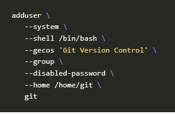 

# On crée un dossier avec la structure nécessaaire à Gitea et on que que Gitea se lance à chaque démarrage on lance donc ces commandes:

>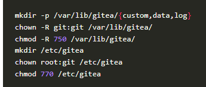 

>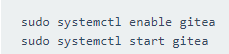 

# Conclusion


En conclusion; nous avons pu apprendre beaucoup de choses .Nous avons donc pu apprendre les objectifs de chaques serveur, la signification de 64 bits ainsi que la création automatique d'une machine virtuelle équipée de gitea.
Nous avons aussi appris les différents balisages de markdown et l'utilisation de pandoc pour une compilation HTML et PDF.


[^1]: https://www.debian.org/doc/manuals/debian-faq/basic-defs.fr.html#pronunciation
[^2]: http://codeur-pro.fr/git-gui-guide-complet/
[^3]: https://git-scm.com/docs/gitk
[^4]: https://www.debian.org/doc/manuals/project-history/releases.fr.html
