# Rapport intermédiaire Saé 2.03
## Prérequis de la machine : 

    • VirtualBox installé 
    
    • 4 Go de RAM minimum

    • 20 Go d’espace disque ou plus
    
    • VirtualBox installé avec son «extension pack» (VBoxGuestAddition.iso) sur la machine hôte.

    
    ___

## Caractéristiques de la machine virtuelle :
    + Nom de la machine  : sae203
    + Dossier de la machine : /usr/local/virtual_machine/infoetu/arthur.delobel.etu
    + Type : Linux
    + Version : Debian ou Debian 11 en 64-bit
    + Mémoire vive (RAM) : 2048 Mo pour être à l’aise à l’usage.
    + Disque dur : 20 Go entier (une seule partition)

# 1.Creation de la machine virtuelle

>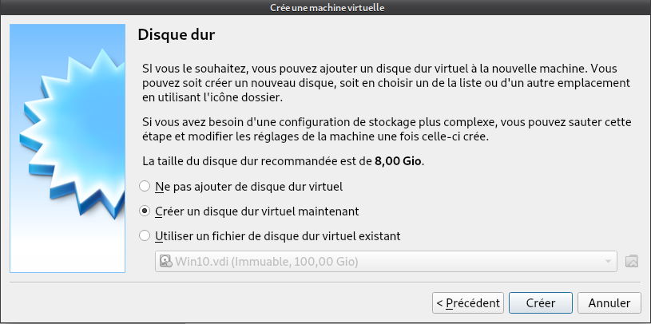
>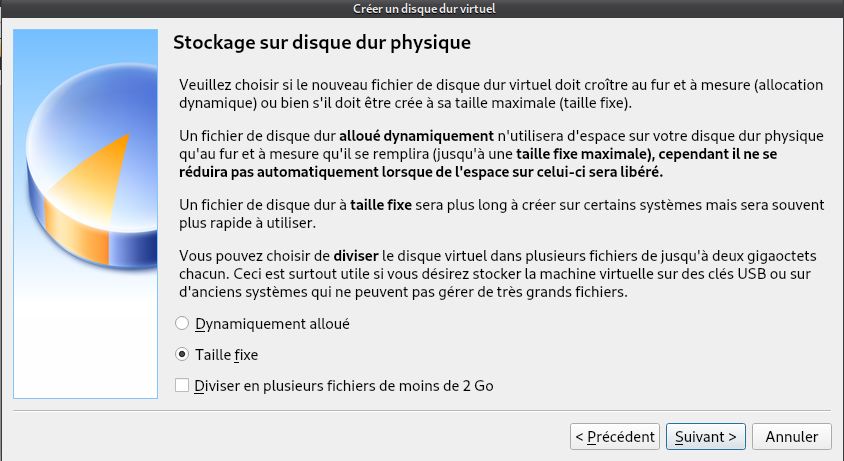
>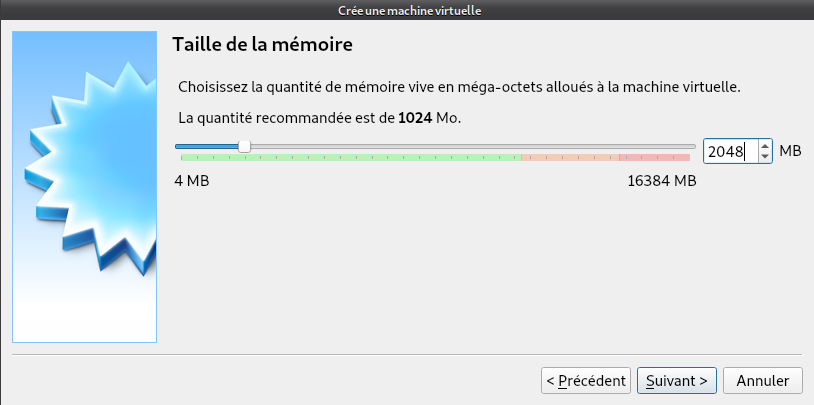
>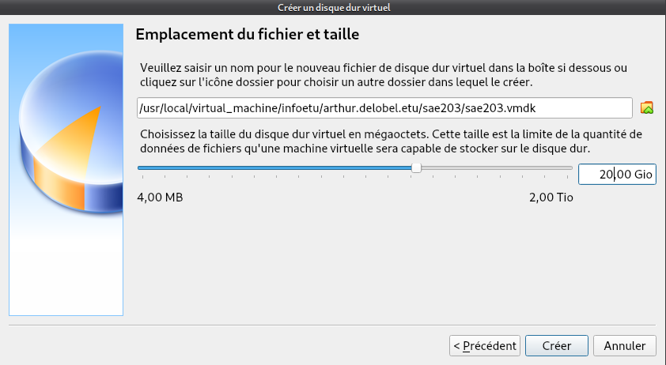
>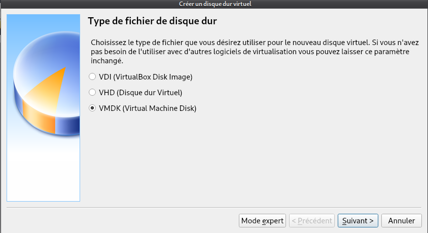

### - Que signifie “64-bit” dans “Debian 64-bit” ?

    Un processeur 64 bits est un microprocesseur dans laquelle la taille d'un mot 
    machine est de 64 bits ; une condition indispensable pour les applications fortement consommatrices de données et de mémoire d'où la mémoire vive (RAM) de 
    2048 Mo et 20go de disque dur afin de supporter l’OS Debian 11.

### - Quelle est la configuration réseau utilisée par défaut ?

C’est Dynamic Host Configuration Protocol (DHCP).

### - Quel est le nom du fichier XML contenant la configuration de votre machine et Sauriez-vous modifier directement ce fichier pour mettre 2 processeurs à votre machine ?

Le fichier Xml qui contient tout la configuration XMl de notre machine s’appelle 
sae203.vbox et donc pour mettre 2 processeur a la machine virtuel il suffit de mettre “<count=2>” 

## Installation de l'OS
Caractéristiques à considérer :

• Nom de la machine  : serveur

• Domaine : Laisser vide

• Pays/langue : France

• Miroir : http://debian.polytech-lille.fr

• Proxy si nécessaire : http://cache.univ-lille.fr:3128

• Compte administrateur : root / root

• Un Compte utilisateur : User / user / user

• Partition : 1 seule partition recouvrant le disque entier

• Sélection des logiciels de démarrage (Paquetages logiciels à préinstaller pour se simplifier la vie par la suite) :
    a. environnement de bureau Debian
    b. … MATE (penser à décocher Gnome)
    c. serveur web
    d. serveur ssh
    e. utilitaire usuels du système

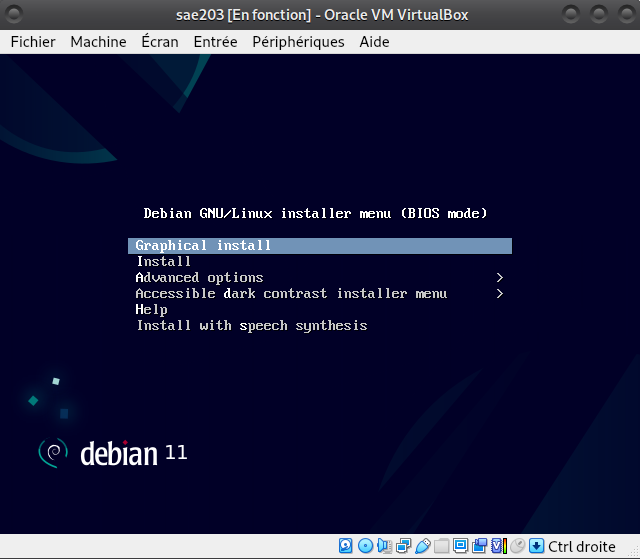
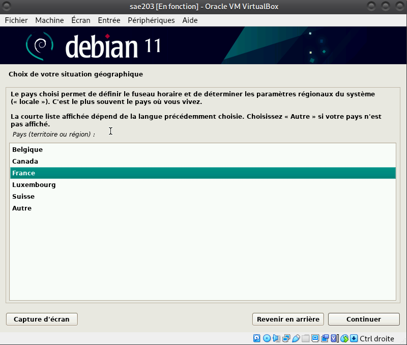
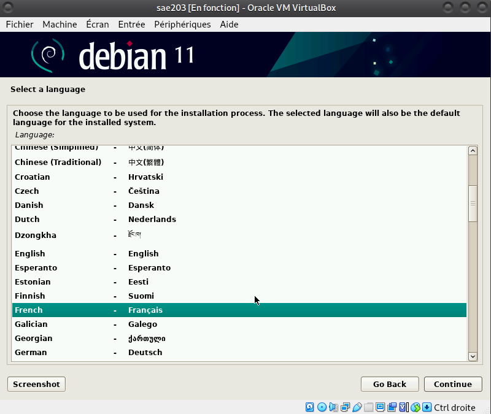
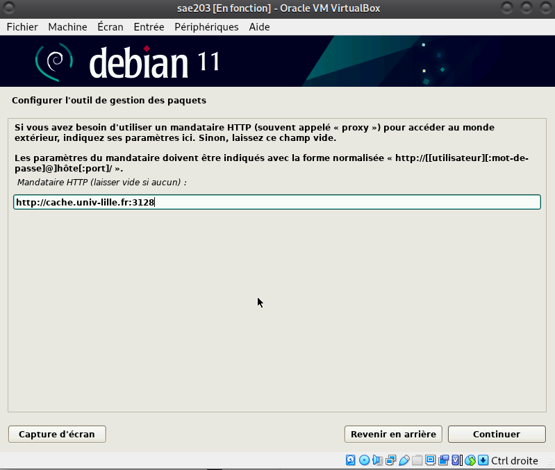
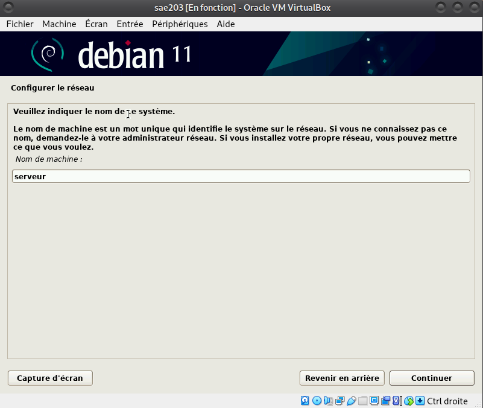
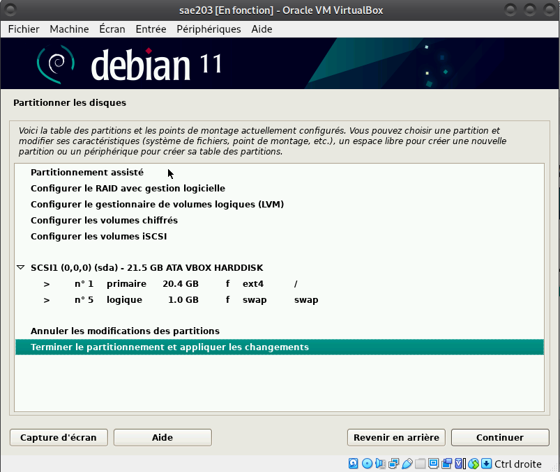
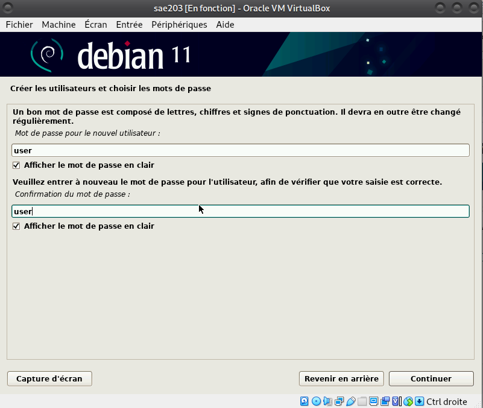
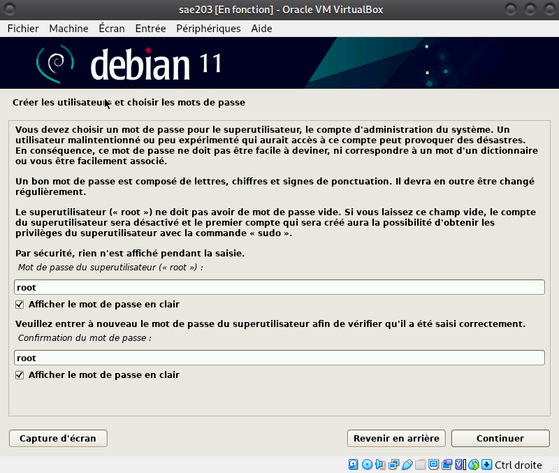
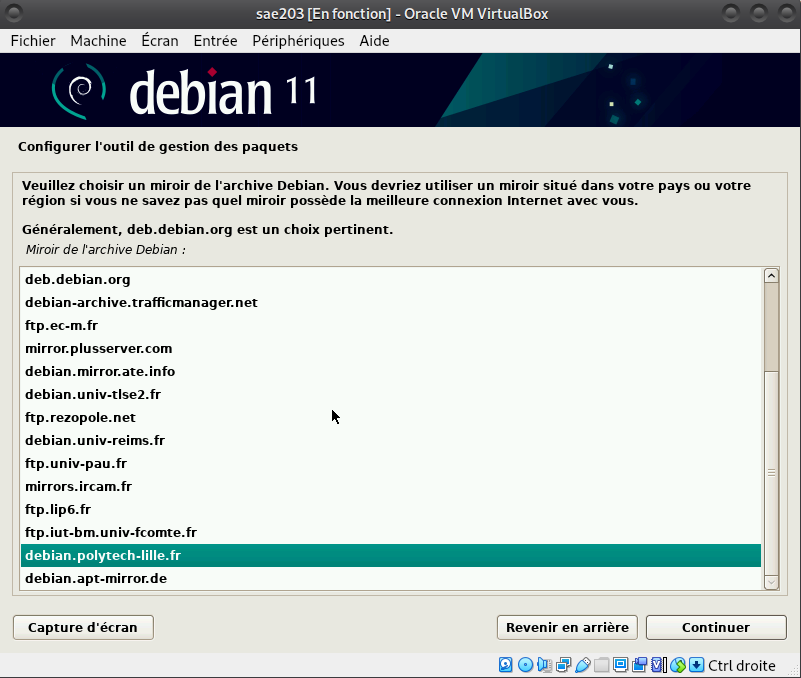
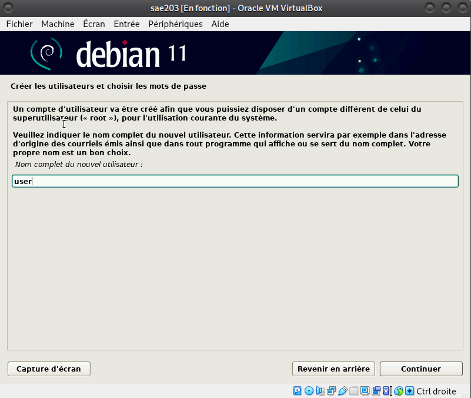
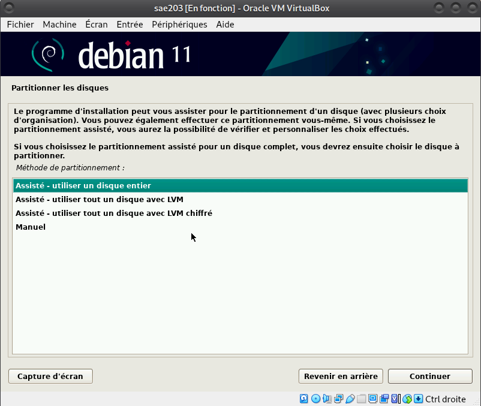
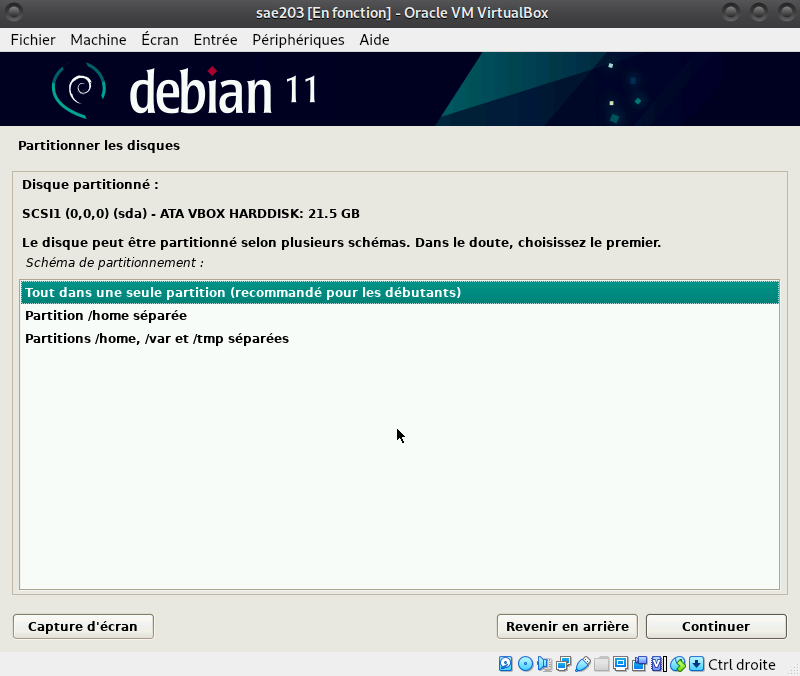
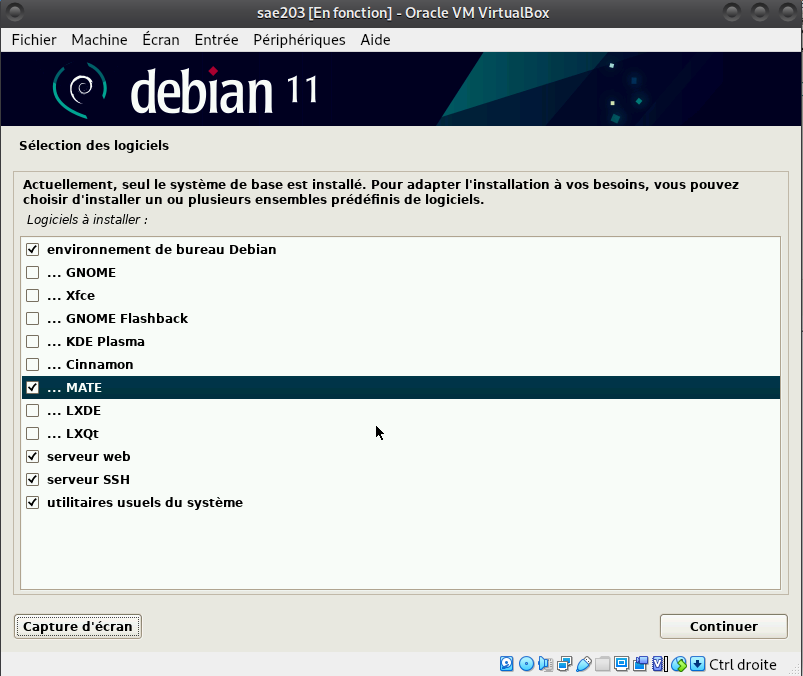

### Qu'est-ce qu'un fichier iso bootable ?

On dit d'un disque qu'il est « bootable » lorsqu'il contient les composants logiciels nécessaires pour être démarré directement au chargement de l'ordinateur,
avant le chargement du système d'exploitation installé sur la machine.

### Qu'est-ce que MATE ? GNOME ?

MATE (prononcer maté à l'espagnole) est un environnement de bureau libre utilisant (dans un premier temps) la boîte à outils GTK+ 3. x et destiné aux systèmes d'exploitation apparentés à UNIX.

### Qu'est-ce qu'un serveur web ?

Un serveur web est un ordinateur qui stocke les fichiers qui composent un site web (par exemple les documents HTML, les images, les feuilles de style CSS,
les fichiers JavaScript) et qui les envoie à l'appareil de l'utilisateur qui visite le site.

### Qu’est-ce qu’un serveur ssh ?

SSH, ou Secure Socket Shell, est un protocole réseau qui permet aux administrateurs d'accéder à distance à un ordinateur, en toute sécurité.
SSH désigne également l'ensemble des utilitaires qui mettent en œuvre le protocole.

### Qu’est-ce qu’un serveur mandataire ?

Dispositif informatique associé à un serveur et réalisant, pour des applications autorisées, des fonctions de médiation,
telles que le stockage des documents les plus fréquemment demandés ou l'établissement de passerelles.

# 2.Installation de debian sur la machine virtuelle

## Accès sudo pour user

• Se connecter en tant que root (identifiant : root, mot de passe : root)

• Activer le Soft Keyboard (Barre du haut de la machine virtuelle -> Entrée -> Clavier -> Soft Keyboard)

• Presser Ctrl + Alt + T pour ouvrir le terminal

• Entrer "sudo addgroup user sudo"

• Se déconnecter puis se connecter en tant que user

### Comment peux-ton savoir à quels groupes appartient l’utilisateur user ?

Pour savoir quel utilisateur appartient à quel groupe, il faut regarder dans le fichier /etc/group.

## Installation des suppléments invités

• Insérer le cd des suppléments (Barre du haut de la machine virtuelle -> Périphériques -> insérer l'image CD des Additions invité...)

• Entrer dans le terminal "sudo mount /dev/cdrom /mnt" pour monter le CD

• Entrer dans le terminal "sudo /mnt/VBoxLinuxAdditions.run" pour installer les suppléments

• Redémarrer la machine virtuelle puis se connecter avec le compte user

>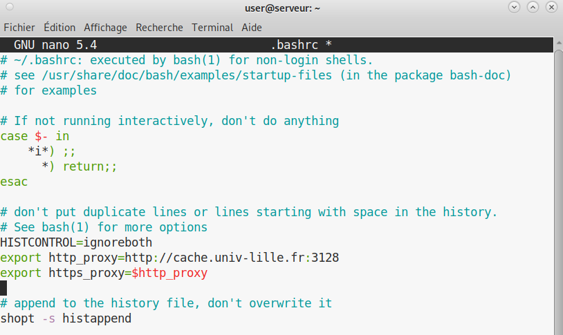
>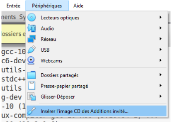
>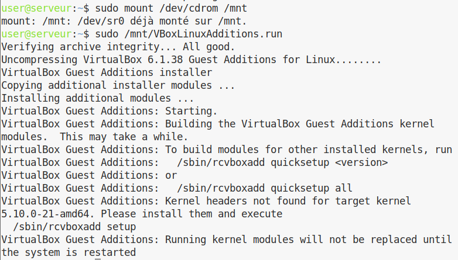
>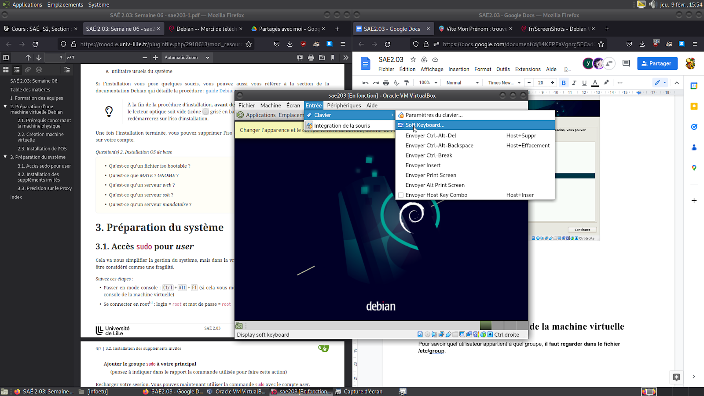
>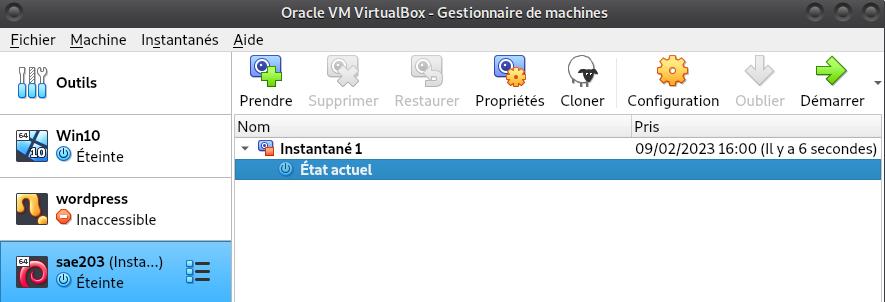
>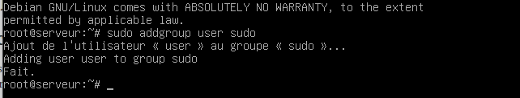
>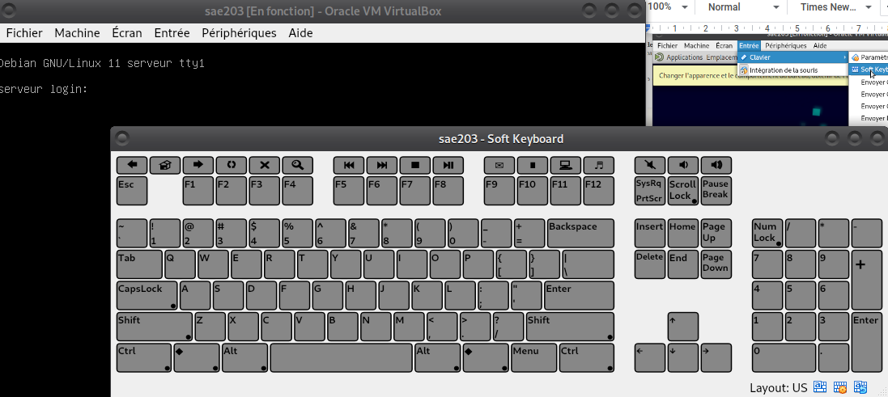

### Quel est la version du noyau Linux utilisé par votre VM ?

La version du noyau linux est 5.10.0-21-amd64

### À quoi servent les suppléments invités ?

• Intégration du pointeur de la souris : permet d'utiliser le même pointeur de souris sur l'hôte et l'invité. En l'activant, vous n'aurez plus qu'un seul pointeur de souris. Il ne sera plus nécessaire d'appuyer sur la touche Hôte pour libérer la souris du système d'exploitation invité.

• Intégration transparente des fenêtres : les fenêtres qui sont affichées sur la machine virtuelle peuvent être mappées sur la machine hôte, comme si l’application sur l’invité était réellement en cours d’exécution sur l’hôte.

• Synchronisation de l’heure entre l’hôte et l’invité.

• Presse-papiers partagé : le presse-papiers du système d’exploitation invité peut être partagé avec le système d’exploitation hôte et inversement.

• Connexions automatisées.

### À quoi sert la commande mount ?

La commande mount permet de demander au système d'exploitation de rendre un système de fichiers accessible, à un emplacement spécifié (le point de montage).

## Précision sur le Proxy

• Pour configurer le proxy sur celui de l'IUT, trouver et ouvrir le fichier "./bashrc", entrer "export http_proxy=http://cache.univ-lille.fr:3128" dans un premier temps,
  puis entrer "export https_proxy=$http_proxy" dans une seconde ligne.

### Yliess El Atifi ; Arthur Delobel ; Bernard Ludovic

